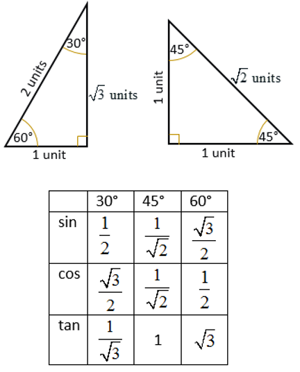

# Chapter 5 - Electrons and bonding

## 5.1 - Electron structure

A orbital is an electron cloud where within the area 2, 6, 10, or 14 electrons may be found.

<figure><figcaption>
The overview of electron shell structure
</figcaption></figure>

<figure><figcaption>
The order of electron shell filling, due to their energy
</figcaption></figure>

The image above shows the order the electron orbitals are filled due to their energy. This is in the order: $$1s^2,2s^2,2p^6,3s^2,3p^6,4s^2,3d^{10}...$$ etc..

<table data-full-width="false"><thead><tr><th></th><th>Electron config</th><th>Shorthand</th></tr></thead><tbody><tr><td>Li</td><td>1s^2,2s^1</td><td></td></tr><tr><td>Na</td><td>1s^2, 2s^2, 2p^6, 3s^1</td><td>\text{[Ne] }3s^1</td></tr><tr><td>K</td><td>1s^2, 2s^2, 2p^6, 3s^2, 3p^6, 4s^1</td><td>\text{[Ar] }4s^1 </td></tr></tbody></table>

The electron configuration can also be shown in spin diagrams as shown below.

<figure><figcaption></figcaption></figure>

## 5.2 - Ionic bonding

