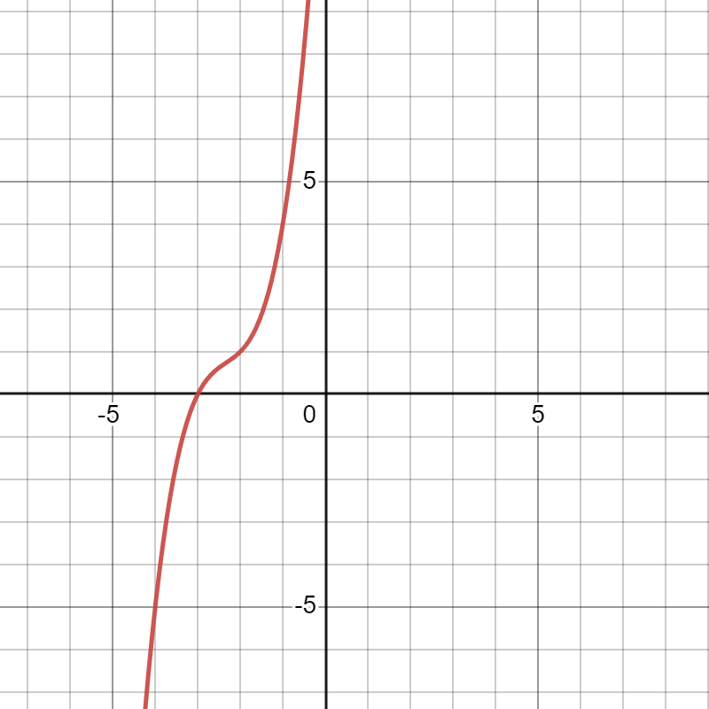

# Chapter 3 - Roots of polynomials

## 3.1 - Quadratic equations

If you know the roots are $$\alpha$$ and $$\beta$$, you can form the quadratic:

$$az^2 + bz +c = 0$$

in factorised form as&#x20;

$$a(z-\alpha)(z-\beta)=0$$

this gives the identity&#x20;

$$az^2+bz+c \equiv a(z-\alpha)(z-\beta) \\ az^2+bz+c \equiv a(z^2-\alpha z-\beta z+\alpha \beta) \\ \equiv az^2-a(\alpha + \beta)z +a\alpha \beta$$

by equating coefficients, we can say:

$$b = -a(\alpha + \beta) \implies \alpha +\beta = -\frac{b}{a} \\ c = a\alpha \beta \implies \alpha \beta = \frac{c}{a}$$

So the sum of the roots is

$$\alpha + \beta = -\frac{b}{a}$$

and the product of the roots is&#x20;

$$\alpha \beta = \frac{c}{a}$$

This gives us information about the roots without actually solving the equation.


The roots of the equation $$2z^2+3z+5=0$$ are $$\alpha$$ and $$\beta$$

(i) Find the values of $$\alpha + \beta$$ and $$\alpha \beta$$.

(ii) Find the quadratic equation with roots $$2\alpha$$ and $$2\beta$$.\
\
(i)\
&#x20;$$\alpha +\beta = -\frac{3}{2} \text{ and}\\ \alpha \beta = \frac{5}{2}$$\

(ii)\
&#x20;$$\text{Sum of new roots } = 2\alpha + 2\beta \\ =2(\alpha + \beta) \\ =2 \times -\frac{3}{2} \\ =-3$$                   $$\text{Product of new roots } = 2\alpha \times 2\beta \\ = 4\alpha \beta \\ = 4 \times \frac{5}{2}\\ = 10$$\
\
$$\text{Let a, b and c be the coefficients in the new quadratic, then} \\ -\frac{b}{a} = -3 \text{ and } \frac{c}{a} = 10 \\ \text{with }a=1 \\ \therefore z^2+3z+10=0$$


## 3.2 - Cubic equations

As in quadratics, if we know the roots $$\alpha$$, $$\beta$$, and $$\gamma$$ we can write the general cubic equations as\
$$az^3 + bz^2 + cz +d=0$$ or in factorised form $$a(z-\alpha)(z-\beta)(z-\gamma) = 0$$

This gives the identity:\
$$az^3 + bz^2 + cz +d \equiv a(z-\alpha)(z-\beta)(z-\gamma)$$\
$$az^3 + bz^2 + cz +d \equiv az^3 - a(\alpha + \beta + \gamma)z^2 + a(\alpha \beta + \beta \gamma + \alpha \gamma)z - a\alpha \beta \gamma$$

By comparing the coefficients we can find:

$$\text{Sum of roots }\sum a\\bz^2 \implies b = -a(\alpha + \beta +\gamma) \\\implies -\frac{b}{a} = \alpha + \beta +\gamma$$      $$\text{Sum of product pairs } \sum \alpha \beta \\cz \implies c = a(\alpha \beta + \beta \gamma + \alpha \gamma) \\\implies \frac{c}{a} =\alpha \beta + \beta \gamma + \alpha \gamma$$       $$\\ \text{Sum of roots} \sum \alpha \beta \gamma\\ d \implies d = -a\alpha \beta \gamma \\\implies -\frac{d}{a} = \alpha \beta \gamma$$

### Substitution method

Similar to the question above in the quadratic section, we can solve more complex new roots by involving a new variable, $$w$$.


The roots of the cubic equation $$2z^3 +5z^2-3z-2=0$$ are $$\alpha, \beta, \gamma$$.\
Find the cubic equation with roots $$2\alpha + 1, 2\beta+ 1, 2\gamma+ 1$$

$$w = 2z+1 \implies z=\frac{w-1}{2} \text{ , you can now substitute this into the previous cubic}$$

$$2z^3 +5z^2-3z-2=0 \\ \iff2(\frac{w-1}{2})^3 + 5(\frac{w-1}{2})^2 - 3(\frac{w-1}{2}) - 2 = 0 \\ \iff \frac{2}{8}(w-1)^3 + \frac{5}{4}(w-1)^2 - \frac{3}{2}(w-1) - 2 = 0 \\ \iff (w-1)^3 + 5(w-1)^2 - 6(w-1) - 8 =0 \\ \iff w^3 + 2w^2 -13w +2 =0$$


## 3.3 - Quartic equations&#x20;

Quartics are the same as the previous two powers but with a fourth root $$\delta$$, the fourth letter of the Greek alphabet.

* _The sum of roots_ $$\sum \alpha = \alpha + \beta + \gamma + \delta = -\frac{b}{a}$$
* _The sum of the product pairs_ $$\sum \alpha \beta  = \alpha \beta + \alpha \gamma + \alpha \delta + \beta \gamma + \beta \delta + \gamma \delta = \frac{c}{a}$$
* _The sum of the product triples_ $$\sum \alpha \beta \gamma = \alpha \beta \gamma + \beta \gamma \delta + \gamma \delta \alpha + \delta \alpha \beta = -\frac{d}{a}$$
* _The product of roots_ $$\alpha \beta \gamma \delta = \frac{e}{a}$$

## 3.4 - Polynomials with complex roots

When solving polynomial equations with real coefficients, remeber that any complex roots occur in conjugate pairs.


The equation $$z^3 +7z^2 + 17z+15=0$$ has one integer root.

(i) Factorise $$f(z) = z^3 +7z^2 + 17z+15$$\
(ii) Solve $$z^3 +7z^2 + 17z+15=0$$\
(iii) Sketch the graph

\
(i) As the is an integer root, it must be a factor of 15. So try $$z= \pm1, \pm3$$, ect.

$$f(1) = 40, f(-1) = 4, f(3) = 156, f(-3) = 0 \\ \therefore \text{using the factor theorem}, (z+3) \text{ is a factor}$$

By algebraic division or inspection, we can rewrite the equation as\
$$f(z) = (z+3)(z^2+4z+5)$$\
then with the quadratic formula, we can find that \
$$z = -2 \pm i$$

\
(ii) The roots are $$z=-3,-2\pm i$$

(iii) \
 <-- Note how it only crosses the x-axis once.

