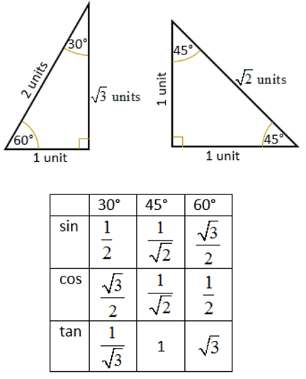

# Chapter 6 - Trigonometry


Some use of surds from [chapter-2-surds-and-indices.md](../chapter-2-surds-and-indices.md "mention") and quadratic equations from [chapter-3-quadratic-functions.md](../chapter-3-quadratic-functions.md "mention")


## 6.1 - Trigonometric functions

The simplest definitions of the trig functions are in terms of the ratios of the sides of a right-angled triangle for values of the angle $$\theta$$. They are:

&#x20;                               $$\text{sin }\theta = \frac{\text{opposite}}{\text{hypotenuse}}$$           $$\text{cos }\theta = \frac{\text{adjacent}}{\text{hypotenuse}}$$                $$\text{tan }\theta = \frac{\text{opposite}}{\text{adjacent}}$$

You can get the values of common angles with the "special triangles":

<figure><figcaption></figcaption></figure>
