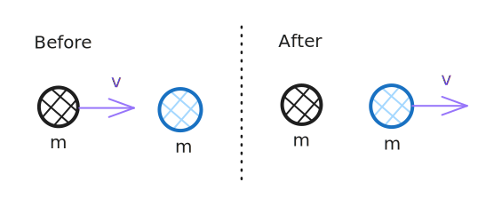

# Chapter 9 - Momentum, force, and energy

The collision of two objects that collide is best analysed with a before and after diagram. Their masses must be taken into account to best understand how they will react.&#x20;

$$\text{momentum } p \text{ (kg ms}^{-1}) = \text{mass } m\text{ (kg)} \times \text{velocity } v \text{ (ms}^{-1})$$

The momentum before and after a collision is identical, this is known as the **conservation of momentum.**

$$
\text{Momentum in} = m_{1} \times v_{1} \iff\text{Momentum out} = m_2 \times v_2
$$

Two objects colliding at offset angles to each other will have constant momentum on each axis.

